<!-- TiaKohir / README.md — profile README, "clinical chart" edition (short form) -->

  

  <picture>
    <source media="(prefers-color-scheme: dark)" srcset="https://readme-typing-svg.demolab.com/?font=Fira+Code&weight=500&size=20&duration=3800&pause=1400&color=60A5FA&center=true&vCenter=true&repeat=true&width=720&height=46&lines=Accuracy+is+a+model+metric.+ROI+is+a+hospital+metric.;Healthcare+AI+starts+with+the+clinician%2C+not+the+model." />
    
  </picture>

  
  &nbsp;
  

 

## 🩺 Chief Complaint

> **"We deployed the AI. What is it worth?"**

Every hospital asks it after go-live. Vendors answer with accuracy. The CFO wants a number. I build the bridge between the two: a defensible, post-deployment value figure for each clinical AI tool a health system runs.

 

## 💼 What I Do

<table>
<tr>
<td width="33%" valign="top">

### 💰 AI ROI for hospitals

Benefit attribution for *deployed* clinical AI. Not the vendor's slide. What actually changed, measured against a baseline, with the displacement effects counted.

</td>
<td width="33%" valign="top">

### 🧬 Clinical data engineering

Epic Clarity / Caboodle → OMOP CDM on Databricks and Microsoft Fabric. Data-quality gates that stop bad data before it becomes a bad number.

</td>
<td width="33%" valign="top">

### 🩺 Workflow → product

Six Epic modules on the build side. Clinician behavior (audit logs, clickstream) turned into product requirements. The human in the loop gets stronger, not redundant.

</td>
</tr>
</table>

 

## 📈 Vitals

<table align="center">
<tr>
<td align="center" width="25%"><b>9+</b> years, provider-side</td>
<td align="center" width="25%"><b>4</b> health systems</td>
<td align="center" width="25%"><b>4</b> live AI tools value-assessed</td>
<td align="center" width="25%"><b>6</b> Epic modules certified</td>
</tr>
</table>

 

## 🏥 Where I've Done It

| Health system | Years | Inside the workflow |
|---|---|---|
| **Stanford Health Care** — Technology & Digital Solutions | 2025–26 | Value assessment of four live clinical AI automations · AI backlog prioritization · 14K-record predictive model on Databricks / Azure |
| **NYU Langone Health** | 2021–23 | Oncology data marts (Hadoop / Impala) · led the ETL audit · Collibra governance |
| **Sutter Health** | 2019–21 | BI and ETL development · KPI reporting |
| **CommonSpirit Health** | 2014–19 | Epic build — ASAP, SmartForms, Cogito, Clarity, Caboodle |

  
  
  
  
  
  
  
  
  
  
  
  
  
  
  

 

## 🩻 Imaging — the AI Lab

Public research on what happens to clinical AI *after* deployment. Synthetic data only. No PHI, anywhere.

<table>
<tr>
<td width="50%" valign="top">

<a href="https://github.com/TiaKohir/-clinical-lakehouse-omop">
<picture>
  <source media="(prefers-color-scheme: dark)" srcset="https://github-readme-stats.vercel.app/api/pin/?username=TiaKohir&repo=-clinical-lakehouse-omop&show_owner=false&hide_border=true&bg_color=00000000&title_color=60a5fa&icon_color=60a5fa&text_color=9ca3af" />
  
</picture>
</a>

**Epic → OMOP CDM on Databricks.** Three sites, eleven injected real-world defects, one data-quality gate that refuses to publish.

</td>
<td width="50%" valign="top">

<a href="https://github.com/TiaKohir/clinical-summary-eval">
<picture>
  <source media="(prefers-color-scheme: dark)" srcset="https://github-readme-stats.vercel.app/api/pin/?username=TiaKohir&repo=clinical-summary-eval&show_owner=false&hide_border=true&bg_color=00000000&title_color=60a5fa&icon_color=60a5fa&text_color=9ca3af" />
  
</picture>
</a>

**Is this LLM summary safe to act on?** Factuality, omissions, relevance — scored against must-keep facts, not fluency.

</td>
</tr>
<tr>
<td width="50%" valign="top">

<a href="https://github.com/TiaKohir/clinician-work-telemetry">
<picture>
  <source media="(prefers-color-scheme: dark)" srcset="https://github-readme-stats.vercel.app/api/pin/?username=TiaKohir&repo=clinician-work-telemetry&show_owner=false&hide_border=true&bg_color=00000000&title_color=60a5fa&icon_color=60a5fa&text_color=9ca3af" />
  
</picture>
</a>

**What an AI deployment actually changes in clinician work.** Audit-log telemetry, difference-in-differences, displacement effects.

</td>
<td width="50%" valign="top">

<a href="https://github.com/TiaKohir/clinician-alert-fatigue-adoption">
<picture>
  <source media="(prefers-color-scheme: dark)" srcset="https://github-readme-stats.vercel.app/api/pin/?username=TiaKohir&repo=clinician-alert-fatigue-adoption&show_owner=false&hide_border=true&bg_color=00000000&title_color=60a5fa&icon_color=60a5fa&text_color=9ca3af" />
  
</picture>
</a>

**Alert fatigue and adoption are one system.** A framework for spending a clinician's attention on purpose.

</td>
</tr>
<tr>
<td colspan="2" valign="top">

<a href="https://github.com/TiaKohir/Healthcare-Fabric-Analytics">
<picture>
  <source media="(prefers-color-scheme: dark)" srcset="https://github-readme-stats.vercel.app/api/pin/?username=TiaKohir&repo=Healthcare-Fabric-Analytics&show_owner=false&hide_border=true&bg_color=00000000&title_color=60a5fa&icon_color=60a5fa&text_color=9ca3af" />
  
</picture>
</a>

**Neurosymbolic validation of AI clinical summaries on Microsoft Fabric.** Deterministic SQL rules catch hallucinated diagnoses, missed allergies, wrong meds.

</td>
</tr>
</table>

 

## 📝 Plan

- **In writing:** a benefit-attribution framework for clinical AI deployments, developed at Stanford Health Care — manuscript in preparation.
- **Open to:** conversations about measuring clinical AI value, clinical data engineering, and healthcare product work.

  

 

  <picture>
    <source media="(prefers-color-scheme: dark)" srcset="https://raw.githubusercontent.com/TiaKohir/TiaKohir/output/github-contribution-grid-snake-dark.svg" />
    
  </picture>

  Chart closed. No PHI was used in the making of this README.

